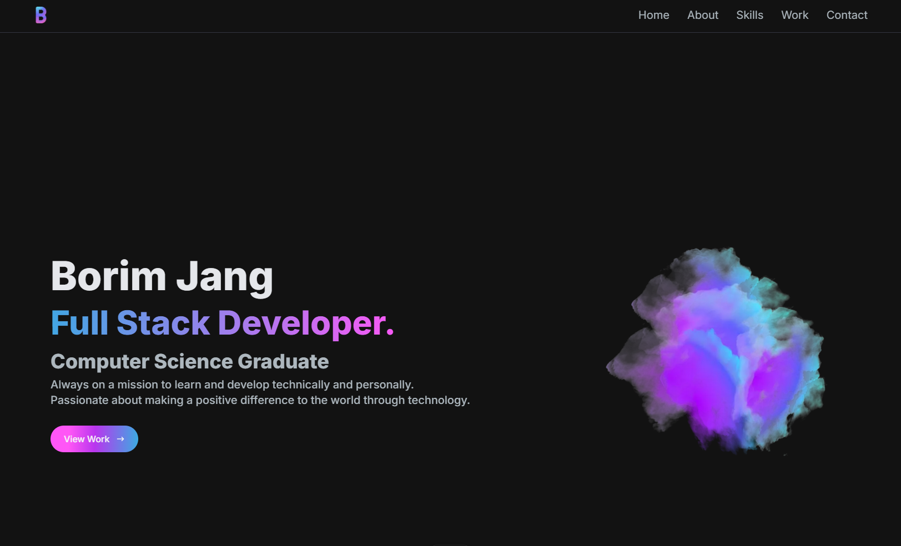

# Portfolio

Welcome to my Portfolio, a dynamic showcase built with NextJS and styled using Tailwind CSS. This portfolio is designed to present my projects and skills in a clean, modern interface. Explore the code or visit the live site to see my work in action.

[**Live Website Link**](https://portfolio-borim.vercel.app/)

## Getting Started

To get a local copy up and running, follow these simple steps:

1. **Fork or Clone the Repository:**
   - Fork the repository to your account or clone it directly using `git clone https://github.com/bjan816/portfolio-borim.git`.

2. **Installation:**
   - Navigate to the project directory and run `npm install` to install the necessary dependencies.

3. **Running the Application:**
   - In the project directory, execute `npm run dev` to launch the app in development mode. Access it via [http://localhost:3000](http://localhost:3000).

## Development Status

This portfolio is actively being developed, which means regular updates and new features. 

## Deployment

The project is deployed on Vercel.

## Extra

This is a [Next.js](https://nextjs.org/) project bootstrapped with [`create-next-app`](https://github.com/vercel/next.js/tree/canary/packages/create-next-app).

This project uses [`next/font`](https://nextjs.org/docs/basic-features/font-optimization) to automatically optimize and load Inter, a custom Google Font.

